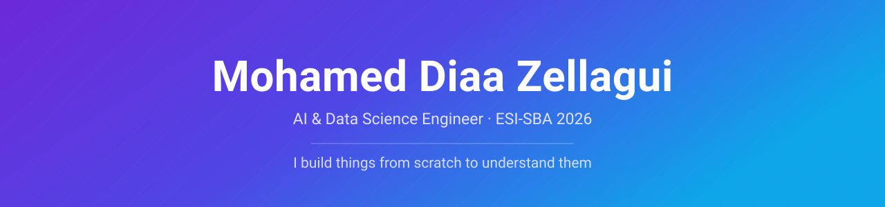

 

 

> I rebuild things before I trust them. Half the projects here started because I wanted to know how something worked, not because anyone asked for them.

 

<table>
<tr>
<td valign="top" width="50%" align="center">

## 🔬 Researcher

  

📄 **2 papers in preparation** — *RefLAM* · *AraMS-28k*

</td>
<td valign="top" width="50%" align="center">

## ⚙️ Engineer

  

📱 **3 years freelance** — apps for early-stage startups

</td>
</tr>
</table>

 

  

  

🎓 ESI-SBA double degree — State Engineer + M.Sc. &nbsp;·&nbsp; 🗣 Arabic · English · French &nbsp;·&nbsp; 📍 Algeria — open to relocation & remote

