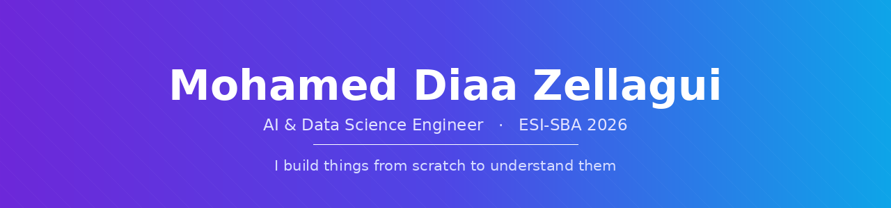

 

> I rebuild things before I trust them. Half the projects here started because I wanted to know how something worked, not because anyone asked for them.

 

 

<table>
<tr>
<td valign="top" width="50%" align="center">

## 🔬 Researcher

  

📄 **Papers in preparation**

</td>
<td valign="top" width="50%" align="center">

## ⚙️ Engineer

  

📱 **3 years freelance**

</td>
</tr>
</table>

 

  

<picture>
  <source media="(prefers-color-scheme: dark)" srcset="https://github-profile-summary-cards.vercel.app/api/cards/repos-per-language?username=diaazg&theme=github_dark">
  <source media="(prefers-color-scheme: light)" srcset="https://github-profile-summary-cards.vercel.app/api/cards/repos-per-language?username=diaazg&theme=default">
  
</picture>
<picture>
  <source media="(prefers-color-scheme: dark)" srcset="https://github-profile-summary-cards.vercel.app/api/cards/most-commit-language?username=diaazg&theme=github_dark">
  <source media="(prefers-color-scheme: light)" srcset="https://github-profile-summary-cards.vercel.app/api/cards/most-commit-language?username=diaazg&theme=default">
  
</picture>

---

## 🗣️ Languages

 

## 📬 Get in touch

 

 

**Open to research and engineering roles** in computer vision, NLP, and multimodal ML — onsite or remote. Also open to **PhD positions** and research collaborations.

🎓 ESI-SBA double degree — State Engineer + M.Sc. in AI & Data Science &nbsp;·&nbsp; 📍 Algeria, open to relocation

